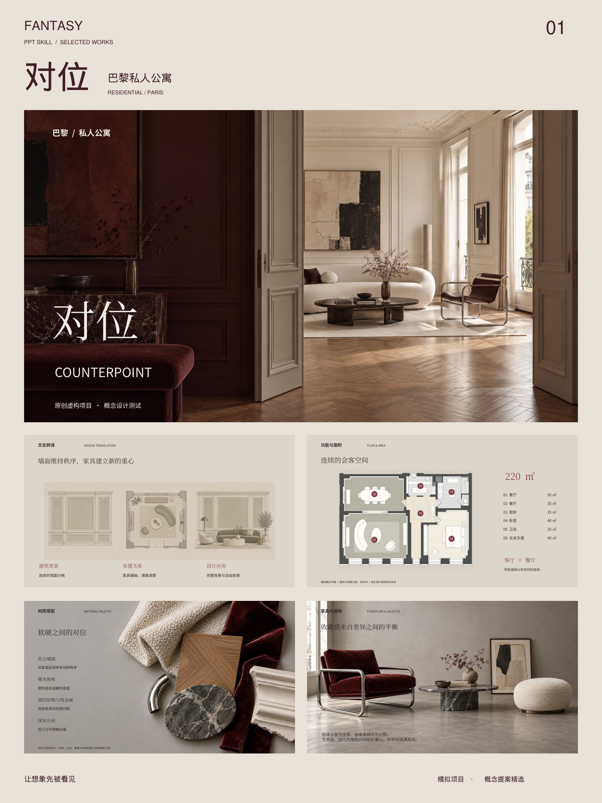
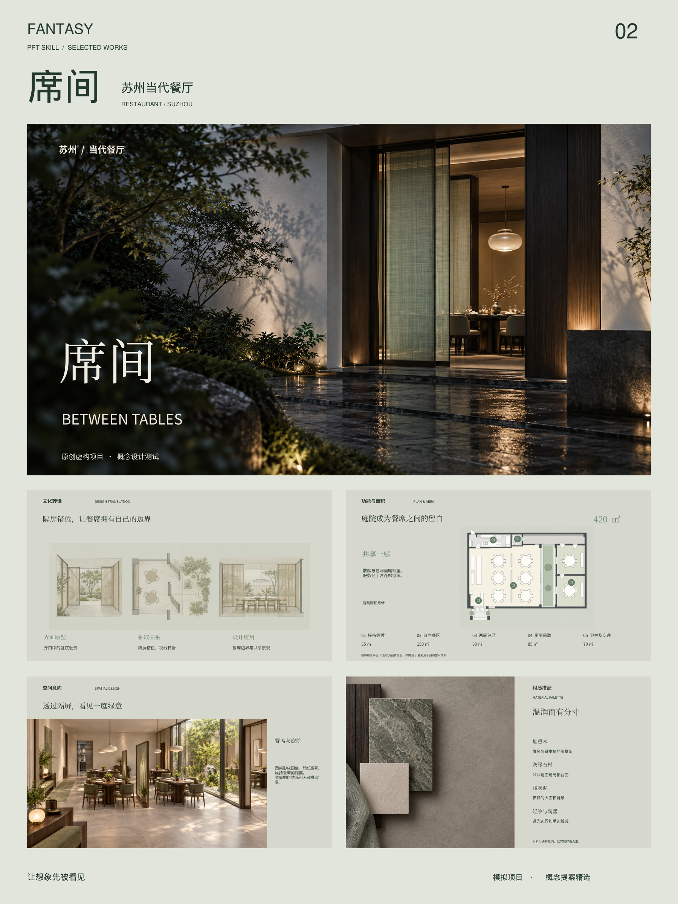
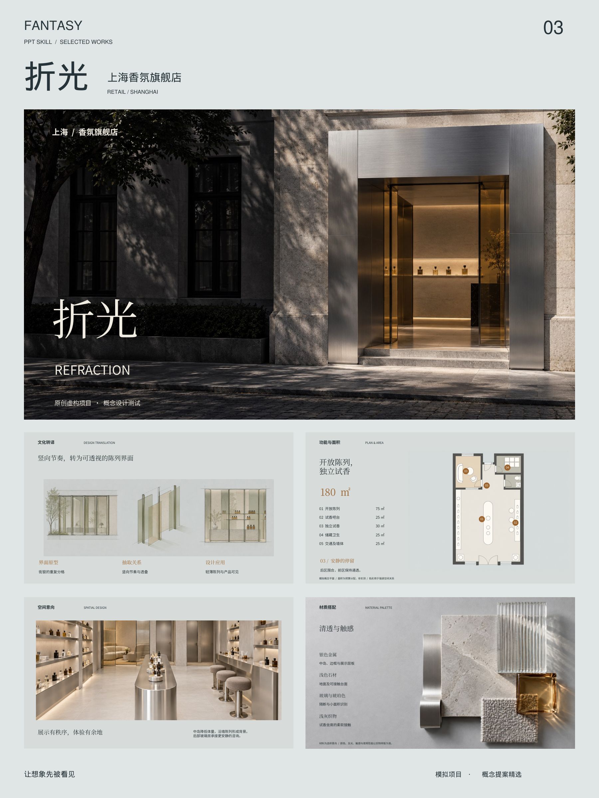
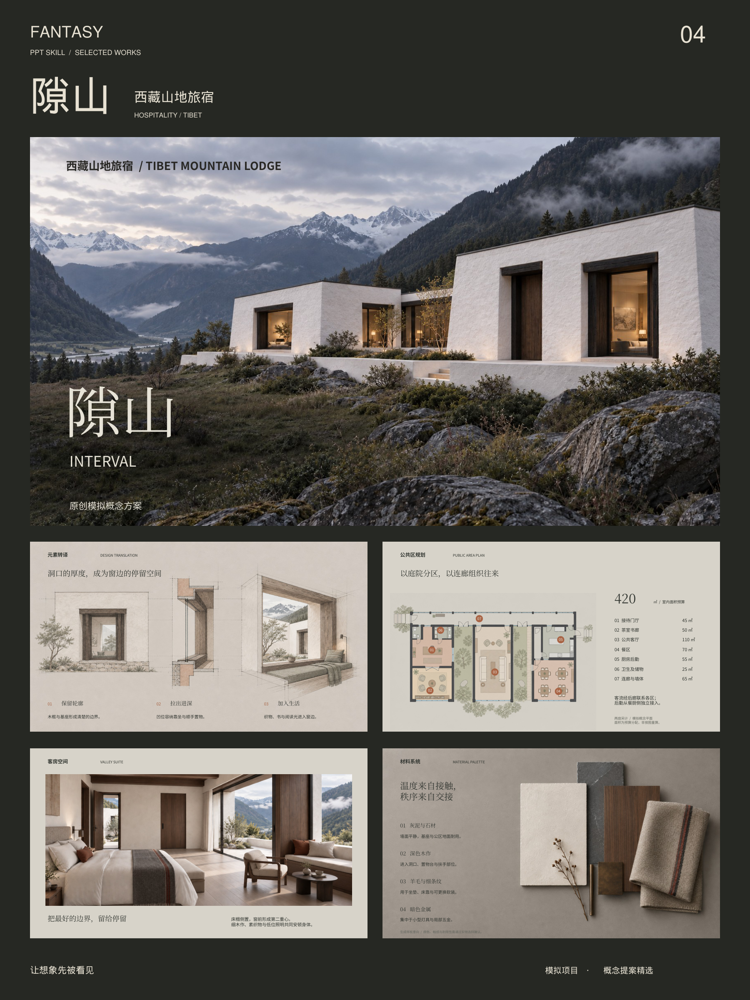

# FANTASY PPT SKILL

### 一个会做概念设计的 PPT Skill

**品牌提案的排版，空间设计师的思考。**

面向室内、建筑、酒店、民宿、餐饮、零售、会所与住宅的中文空间设计提案工作流。将项目事实、地方文化、设计概念与空间手法组织成有依据、有节奏、可以继续修改的演示文稿。

仓库品牌名称为 **FANTASY PPT SKILL**；技能调用名称保留为 **`ppt-image-deck`**。入口：[SKILL.md](SKILL.md)。

## 成品案例精选

四个模拟项目，分别展示住宅、餐饮、零售与酒店方向。每张竖版组合图包含一张封面和四张精选内页，保留原提案中的分析、平面和材质表达。

| 对位 · 巴黎私人公寓 | 席间 · 苏州当代餐厅 |
| --- | --- |
|  |  |
| 折光 · 上海香氛旗舰店 | 隙山 · 西藏山地旅宿 |
|  |  |

**[下载四张高清竖图 ZIP](downloads/fantasy-ppt-portrait-gallery.zip?raw=true)** · [查看 PDF 合集](downloads/fantasy-ppt-selected-works.pdf) · [案例与页码说明](docs/GALLERY.md)

图片为 3:4、1800 × 2400 像素。以上是 Skill 工作流测试中的模拟设计提案，不代表已建成项目；下载包为展示图，不包含这些案例的完整源 PPT。

## 从这里开始

| 你想做什么 | 阅读入口 |
| --- | --- |
| 安装和调用 | [安装说明](docs/INSTALLATION.md) |
| 给出完整项目任务书 | [使用方法与示例](docs/USAGE.md) |
| 理解提案结构与视觉标准 | [设计工作流程](docs/WORKFLOW.md) |
| 查找每份参考指南 | [文件与参考索引](docs/REFERENCE_GUIDE.md) |
| 导出和检查 PPT | [脚本与验证](docs/SCRIPTS.md) |
| 了解字体、参考图与使用边界 | [素材说明](docs/ASSETS_AND_LICENSES.md) |
| 排查字体、编辑性与模板感 | [常见问题](docs/FAQ.md) |

## 能帮助完成什么

- **项目研究**：区位、文化、历史线索与使用需求，区分事实、判断、提案和未知条件。
- **概念推导**：从地域和材料中提炼设计语言，将文化来源连接到具体空间动作。
- **视觉表达**：概念氛围、元素演化、材质关系、空间节奏、简洁的分析页。
- **汇报组织**：目录、项目定位、概念、规划、空间设计、材质陈设与设计愿景。
- **交付检查**：文字可编辑性、字体声明、页面数量与结构检查，并要求实际渲染审阅。

这是一套供 AI 助手执行的技能与参考资源，运行依赖宿主提供的读写文件、图像生成、检索、PPT 创建和渲染能力。仓库本身不包含模型服务或一键生成完整设计的独立应用。

## 一句话开始

```text
使用 $ppt-image-deck，为杭州西湖周边约850㎡的东方私宴会所制作概念提案。
从庭院、借景、光影和游园提炼设计语言。先做概念研究，不生成效果图。
排版简约、有质感；分析图讲清演化过程；所有标题和正文保持可编辑。
未知场地条件明确写为模拟假设，最后加入项目设计愿景与谢谢。
```

## 设计原则

### 1. 让每个项目有自己的概念

分析需要回答“为什么这样设计”。文化提取应能追溯到原始依据，并落到比例、边界、节奏、光线、材料或使用方式。不同项目不机械套用同一组关键词或同一种客户动线。

### 2. 用多个词汇共同建立项目概念

多图氛围页中的每张关键图片应有对应概念词。例如水面、纱帘、器物和竹影，可以组成 **水庭 · 轻隔 · 素器 · 筛光**，再用较小的“有边界的相聚”统领。词数、词长和构图依项目调整，图片与词汇一一对应。

### 3. 让分析图可读，让页面有呼吸

元素演化可采用二维线框、草图模型、图块和克制的色彩。概念视觉可生成，地理和工程信息必须有可靠依据。正文控制密度，标题、观点、说明形成明确层级；布局按信息关系变化。

### 4. 重要页面建立自己的视觉

封面、目录和章节主视觉优先采用项目原创或明确获准使用的图像。参考作品用于学习图文比例、留白和结构；不冒充本项目成果。

### 5. 以愿景完成汇报

尾页表达项目独有的设计愿景，并包含“谢谢 / THANK YOU”。氛围底图与项目一致，避免空泛的工作清单式结束。

## 支持的工作阶段

| 阶段 | 主要内容 | 图纸与效果图 |
| --- | --- | --- |
| 概念研究 | 项目解读、概念、元素、手法、材质方向 | 可按要求暂不制作 |
| 完整方案汇报 | 区位文化、规划、空间、材料陈设 | 对应效果图前安排平面 |
| 既有 PPT 优化 | 结构补齐、排版、文案层级、素材替换 | 保留已认可内容，定向修改 |

## 可编辑交付说明

| 类型 | 实际编辑范围 |
| --- | --- |
| 分层 PPT | 标题、正文、标签为原生文本；图片独立放置 |
| 混合 PPT | 复杂拼贴或分析视觉可为图片，关键文字可编辑 |
| 整页图片 PPT | 页面作为单张图片插入，图片内文字不可编辑 |

仓库中的 `merge_images_to_pptx` 是第三种导出方式。它不会把图片自动还原成文字和矢量图。原生可编辑页面需要宿主另行构建。

## 仓库组成

- `SKILL.md`：执行入口与核心原则。
- `agents/`：技能展示和调用元数据。
- `references/`：项目真实性、排版、概念图、字体、工作流与质量指南。
- `assets/`：随包排版参考、分析示例、预览和三款思源字体。
- `scripts/`：图片合并、PPT 结构检查与项目文件检查。
- `docs/`：完整安装、使用、流程和维护说明。

## 当前边界

生成的模拟彩平和效果图属于概念表达，不能作为测绘或施工依据。真实地图的路网、边界、比例和地名不能依赖生成模型猜测。字体随包提供不代表已嵌入输出 PPT。结构检查通过也不代表视觉质量通过。

参考图片、字体及其他第三方资源各有权利归属；公开可见不自动赋予再分发或商用许可。详见[素材说明](docs/ASSETS_AND_LICENSES.md)。
